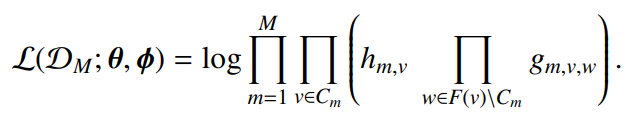
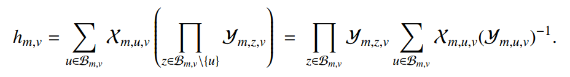
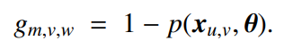
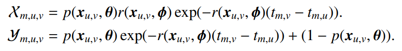

# Foodvocate
<div align=center></div>

## Introduction
An analysis on the cascading behavior between Taiwanese Instagram food bloggers, based on Asynchronous Independent Cascade Model (AsIC) and Influence Maximization Model.

## Asynchronous Independent Cascade Model (AsIC)
I apply AsIC on bloggers' *check in* posts in the same location. I assume that one blogger's post at certain location might influence other bloggers and trigger them going to the same place. I collect popular posts from 108 locations, it becomes 91 locations left after data cleaning, which contains 578 unique bloggers in total. For more detail about web scarping and data cleaning see [/Instagram](Instagram).

To better implement AsIC model, here are some extra assumptions.
1. I assume that for each location, it is regarded as a independent cascading event. 
2. I assume that there is a *Clique* networks between bloggers.

### Log Likelihood Function 
* The likelihood function is the aggregation of h and g:

* h is the probability density that node w is activated at time t.

* g is the probability density that that node s is not activated by node w

* Within h, X is the probability density that node v activate node w at time t, Y is the probability density that that node w is not activated by node v.


### Adjusted Log Likelihood Function 
For the chance that a bloggers'post appear in the popular posts section is different, I have to adjust the probability density function. Given that node v exist, the chance that successfuly activate node w is:
```
show * p
```
And the chance that failed to activate node w is:
```
show * (1-p) + no_show = 1 - show * p
```
And for the assumption that there is a *Clique* networks between bloggers, it will cause the over-estimation on g for certain nodes that frequently activated. To fix it, I calculate the g for every node based on the frequency count according to real observation to spread out the effect of g. Also, it is multiplied by a weighted term 'average not showing node / toatl' to restore the effect of g. 

### Optimization Process
I apply scipy.optimization.minimize(method='BFGS') to do the optimization.
The gradient caculation process is detailed described in [ASIC.ipynb](AsIC).

## Influence Maximization Model
I also apply greedy influence maximization model based on the result of AsIC, with multithreading to speed up the simulation. It is calculated both under and not under the cost assumption that the cost to cooperate with a food blooger is 1/10 of the blogger's fans.

## Reference
1. Saito, K., Kimura, M., Ohara, K., & Motoda, H. (2010). Selecting information diffusion models over social networks for behavioral analysis. 
2. Saito, K., Ohara, K., Yamagishi, Y., Kimura, M., & Motoda, H. (2011). Learning diffusion probability based on node attributes in social networks. 